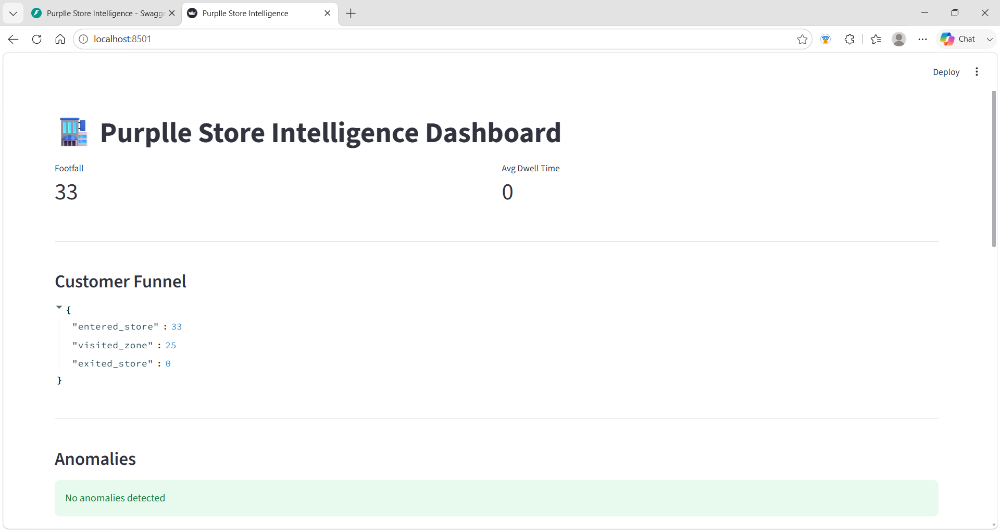
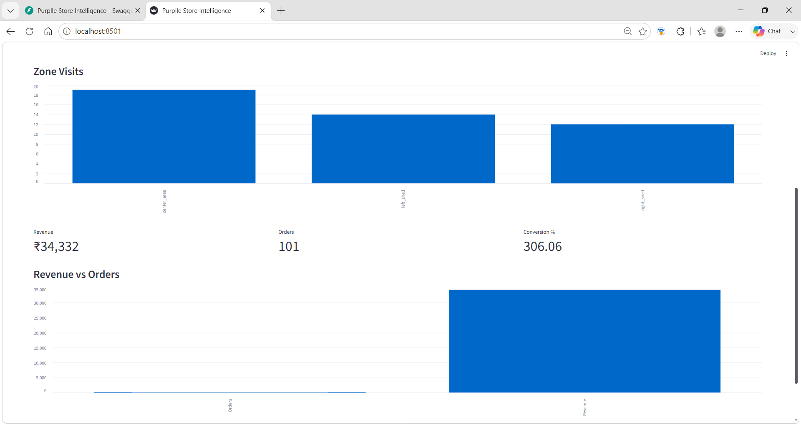
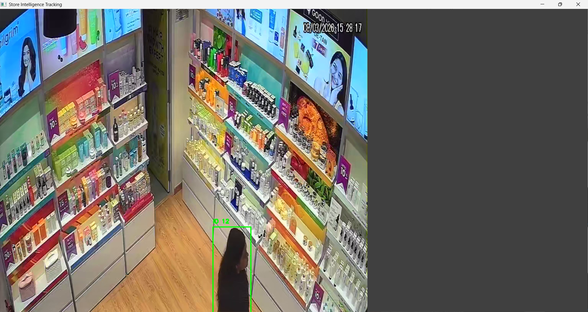
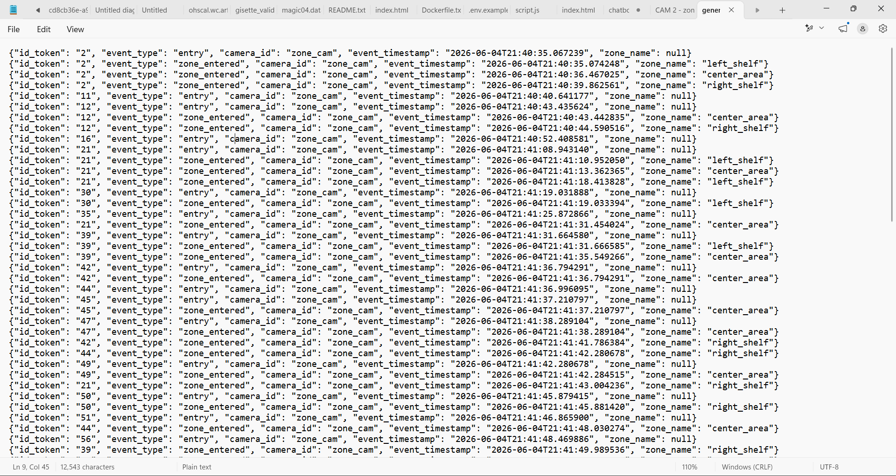

# Purplle Store Intelligence System

## Overview

This project was developed as part of the Purplle Tech Challenge 2026 Round 2.

The objective is to transform raw CCTV footage into actionable retail intelligence by combining computer vision, event generation, analytics, APIs, and a dashboard. The system processes CCTV video feeds, detects and tracks customers, generates structured events, computes business metrics, and visualizes insights through a dashboard.

The solution focuses on practical engineering decisions, modular design, and production-ready implementation.

---

## Problem Statement

Retail stores generate large amounts of CCTV footage, but extracting meaningful business insights manually is difficult.

This project aims to automatically:

* Detect and track customers
* Generate store events
* Measure customer activity
* Analyze zone engagement
* Compute business metrics
* Detect anomalies
* Provide APIs and dashboard-based insights

---

## Solution Architecture

```text
CCTV Video
    │
    ▼
YOLOv8 Person Detection
    │
    ▼
Tracking Pipeline
    │
    ▼
Event Generator
    │
    ▼
JSONL Event Store
    │
    ├── FastAPI Backend
    │
    ├── Business Analytics
    │
    └── Streamlit Dashboard
```

---

## Features

### Computer Vision

* Person Detection using YOLOv8
* Multi-frame tracking
* Video processing pipeline
* Frame skipping optimization for faster inference

### Event Generation

The system generates structured events such as:

* entry
* exit
* zone_entered

Each event contains:

* Customer ID
* Camera ID
* Timestamp
* Event Type
* Zone Information

### Analytics

The system computes:

* Footfall
* Average Dwell Time
* Zone Visits
* Conversion Rate
* Total Revenue
* Total Orders
* Average Order Value

### Anomaly Detection

The system identifies:

* Crowd spikes
* Unusual traffic patterns

### APIs

Implemented endpoints:

| Endpoint          | Description                |
| ----------------- | -------------------------- |
| /metrics          | Footfall and dwell metrics |
| /funnel           | Customer funnel analytics  |
| /anomalies        | Detected anomalies         |
| /zones            | Zone analytics             |
| /sales_metrics    | Revenue and order metrics  |
| /business_metrics | Combined business KPIs     |

---

## Dashboard

The Streamlit dashboard provides:

* Footfall Monitoring
* Dwell Time Analytics
* Revenue Tracking
* Conversion Metrics
* Funnel Visualization
* Zone Analytics
* Anomaly Monitoring

---

## Project Structure

```text
store-intelligence/
│
├── app/
│   ├── api.py
│   ├── detector.py
│   ├── tracker.py
│   ├── events.py
│   ├── metrics.py
│   ├── anomalies.py
│   ├── event_generator.py
│   ├── sales_metrics.py
│   └── video_processor.py
│
├── dashboard/
│   └── streamlit_app.py
│
├── data/
│   ├── events/
│   ├── videos/
│   └── sample_transactions.csv
│
├── DESIGN.md
├── CHOICES.md
├── Dockerfile
├── docker-compose.yml
├── requirements.txt
└── README.md
```

---

## Installation

### Clone Repository

```bash
git clone <repository-url>
cd store-intelligence
```

### Create Virtual Environment

```bash
python -m venv .venv
```

### Activate Environment

Windows:

```bash
.venv\Scripts\activate
```

### Install Dependencies

```bash
pip install -r requirements.txt
```

---

## Running the Application

### Run API

```bash
uvicorn app.api:app --reload
```

Access:

```text
http://127.0.0.1:8000/docs
```

### Run Dashboard

```bash
streamlit run dashboard/streamlit_app.py
```

### Process CCTV Video

```bash
python -m app.video_processor
```

---

## Docker Deployment

Build:

```bash
docker compose build --no-cache
```

Run:

```bash
docker compose up
```

---

## Engineering Decisions

### Why YOLOv8?

YOLOv8 provides a strong balance between detection accuracy and inference speed, making it suitable for retail analytics scenarios.

### Why Frame Skipping?

Instead of processing every frame, the system processes every 5th frame. This significantly reduces computational cost while maintaining useful analytics quality.

### Why JSONL Events?

JSONL enables lightweight event storage, easy debugging, and compatibility with streaming/event-based architectures.

### Why FastAPI?

FastAPI offers high performance, automatic documentation, and rapid API development.

### Why Streamlit?

Streamlit allows rapid development of interactive dashboards with minimal overhead.

---

## Future Improvements

* ByteTrack integration for stronger tracking
* Multi-camera identity association
* Heatmap generation
* Queue detection
* Real-time event streaming
* Cloud deployment
* Database-backed event storage
* Advanced anomaly detection

---

## Screenshots

### Dashboard






### API Documentation


### Detection Pipeline



### Event Generation



---

## Author

Kavyanjali Vijjana

Purplle Tech Challenge 2026 Submission
